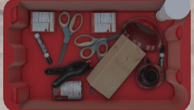
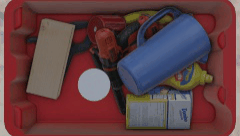

# SynpickVP Dataset

This repository contains modules to load and preprocess the SynpickVP dataset

SynpickVP is a synthetic dataset for video-based prediction tasks in bin-picking scenarios.
This dataset consisting of videos of various bin-picking scenarios in which a suction-cap gripper robot moves in arbitrary directions in a cluttered box containing different objects.
SynpickVP is formed by processing a selection of from the [Synpick dataset](https://www.ais.uni-bonn.de/datasets/synpick/). Namely, all sequences in SynpickVP fulfill the following conditions:
 - All objects are already placed in the box
 - The robotic gripper is in the box
 - The robotic gripper is moving in the sequence

 

 

 


## Download

To download the data, please contact [Angel Villar-Corrales](http://angelvillarcorrales.com/templates/home.php).


## Contact and Citation

This repository is maintained by [Angel Villar-Corrales](http://angelvillarcorrales.com/templates/home.php),

Please consider citing the following works if you find our work or our repository helpful.

```
@inproceedings{villar2022MSPred,
  title={MSPred: Video Prediction at Multiple Spatio-Temporal Scales with Hierarchical Recurrent Networks},
  author={Villar-Corrales, Angel and Karapetyan, Ani and Boltres, Andreas and Behnke, Sven},
  booktitle={British Machine Vision Conference (BMVC)},
  year={2022}
}

@inproceedings{periyasamy2021synpick,
  title={Synpick: A dataset for dynamic bin picking scene understanding},
  author={Periyasamy, Arul Selvam and Schwarz, Max and Behnke, Sven},
  booktitle={International Conference on Automation Science and Engineering (CASE)},
  year={2021},
}
```

In case of any questions or problems regarding the project or repository, do not hesitate to contact the authors at villar@ais.uni-bonn.de.
